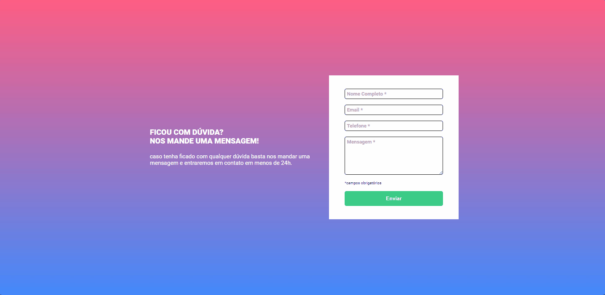

<h1 align="center">Formulário com validação</h1>
 

### 🚨 Sobre o Projeto

Este projeto é um desafio proposto em um curso que estou realizando para melhorar meus conhecimentos em HTML, CSS e JavaScript. O objetivo é criar um formulário com validação em JS.

<strong>Link:<strong> https://joaonodari.github.io/dasafioFV/

### 🔨 Ferramentas Utilizadas

* [HTML](https://developer.mozilla.org/pt-BR/docs/Web/HTML)
* [CSS](https://developer.mozilla.org/pt-BR/docs/Web/CSS)
* [JSS](https://developer.mozilla.org/pt-BR/docs/Web/JavaScript)

### 📽️ Projeto 

    </img>
    
Landing Page aberta no Desktop

